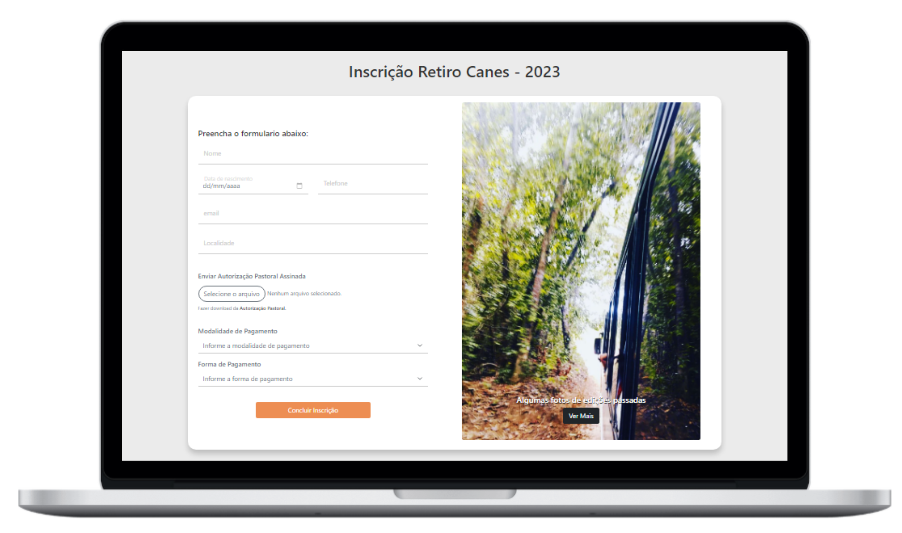
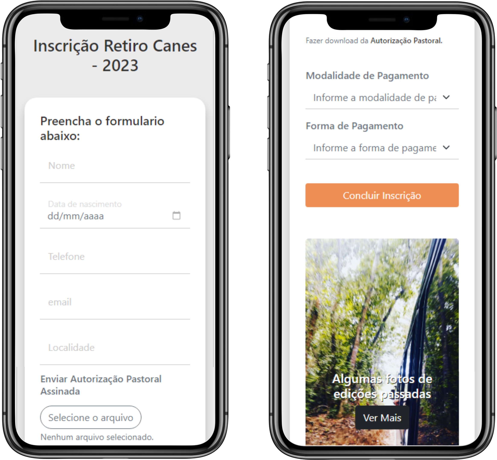

# Formulario de inscrição - Retiro Canes 2023

Formulario de inscrição com envio de dados para planilha, email e tela de verificação.

    

 

    

# Tecnologias

- `HTML`;
- `CSS`;
- `Javascript`;
- `Bootstrap`;
- `Foundation for Emails 2`;
- `Nodemailer`;
- `express`
- `Handlebars`;

# Tasks

- [x] Criar formulario responsivo desktop/mobile;
- [x] Criar Slider com fotos;
- [x] Criar `tela de sucesso` para confirmação do usuário;
- [x] Criar `Overlay` para bilhete individual;
- [x] Capturar valores dos Inputs com JS;
- [x] Validar para ver se os campos estão vazios;
- [x] Configurar Data;
- [x] Capturar nome do `input file`;
- [ ] Capturar arquivo do `input file`;
- [x] Salvar Valores no LocalStorage;
- [x] Enviar Valores do LocalStorage para Banco de Dados;
- [x] Configurar `express`;
- [x] Enviar inscrição individual para email usando `Nodemailer`;
- [ ] Enviar arquivo capturado pelo `input file` para email usando `Nodemailer`;
- [x] Capturar Valores do LocalStorage para confirmação de dados da `Tela de sucesso`;
- [x] Capturar Valores do LocalStorage para `Overlay` da `Tela de sucesso`;
- [x] Colocar em caixa alta os valores do overlay;
- [x] Converter o `Overlay` de `SVG` para `PNG`;
- [x] Tirar print do `Overlay`;
- [x] fazer download do `Overlay`;
- [ ] alterar texto de pagamento, conforme selecionado pelo mesmo;
- [ ] Direcionar o usuario para o pagamento conforme o selecionado pelo mesmo;
- [ ] Criar um Modal para pagamento com PIX;
- [ ] Criar botão de `Nova Inscrição` resetando o LocalStorage;
- [ ] Verificar todos os `Links de Whatsapp`;
